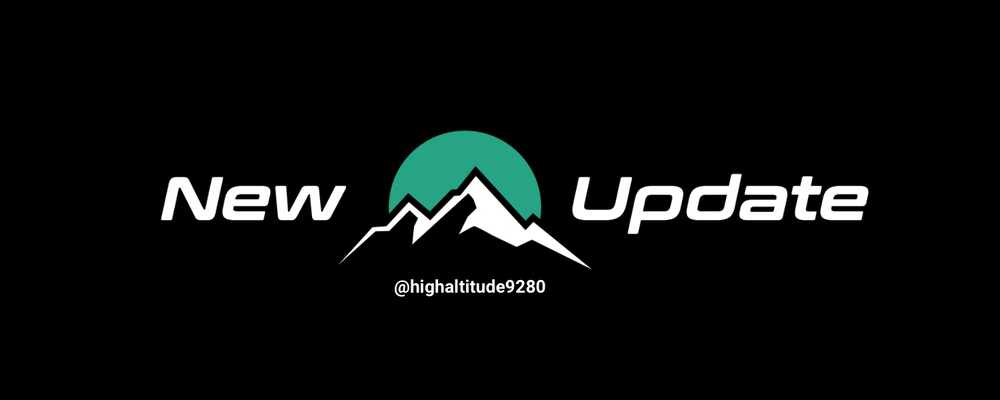

<!-- =========================================================
  High Altitude 9280 — RobotCode_2026
  Theme: #009280 (primary) / #22bf90 (accent)
========================================================== -->

<p align="center">

  

</p>

<div align="center">

  ❄️ <a href="https://linktr.ee/team9280"><b>High Altitude 9280 Linktree</b></a> ❄️

  <br/><br/>

  <h2>
    <span style="color:#009280"><strong>RobotCode_2026</strong></span>
  </h2>

  <p>
    <b>Replay-First</b> robot codebase for FRC 2026 — built to iterate fast, debug faster, and fail in sim/replay (not on the field).
  </p>

  <p>
    <a href="https://github.com/HighAltitude9280/RobotCode_2026/actions"></a>
    
    
    
    
  </p>

</div>

---

## 🧠 What is this?

This repo contains Team 9280 (High Altitude Robotics) **FRC 2026** robot code, designed around one core idea:

> **If it’s not logged, it didn’t happen.**
> Logs are our source of truth — for diagnosis, tuning, and regression checks.

We’re moving from a custom Command-Based setup to a **LoggedRobot + AdvantageKit** backbone to make bugs reproducible and iteration loops shorter.

---

## 🏗️ Architecture (Replay-First)

We follow a “same codepath, different IO” model:

- **Subsystem = Logic** (state, control goals, sequencing, safety)
- **IO = Hardware boundary** (sensors + actuators)

Implementations:
- `IOReal` → real hardware
- `IOSim` → simulation models
- `IOReplay` → log playback

This lets us run **the same robot logic** in Real / Sim / Replay without rewriting behavior.

---

## 📦 Repo Layout

```txt
still in build
````

---

## 📊 Logging Baseline (Minimum)

We log enough to answer “why did we lose the cycle?” quickly:

**Drivetrain / Swerve**

* pose, gyro yaw, module states + setpoints
* odometry latency, slip/traction indicators
* accel limiting / saturation events

**Mechanisms (Shooter / Indexer / Intake / etc.)**

* RPM + setpoint, current, temp
* sensors (beam breaks, etc.)
* state machine state

**Auto**

* selected auto, path progress, tracking errors
* aim status, shot timing markers

---

## ⚡ Quickstart

### Requirements

* WPILib 2026 installed (VS Code)
* JDK 17

### Build

```bash
./gradlew build
```

### Deploy to RoboRIO

```bash
./gradlew deploy
```

### Sim

```bash
./gradlew simulateJava
```

---

## 🎛️ Replay Workflow (The whole point)

1. Run a match / practice session and generate logs
2. Open in AdvantageScope
3. Replay the same codepath to reproduce bugs frame-by-frame

**We treat replay as a gate:** if replay breaks, we fix it before we move on.

---

## ✅ Standards (Non-Negotiables)

* No merge if **Replay breaks**
* No silent **log key** changes
* Keep naming + folder structure consistent (rookie-proof)

---

## 🤝 Contributing (Team Rules)

**Branching**

* `main` = stable / comp-ready
* feature branches per subsystem (ex: `feature/drivetrain-io`, `feature/shooter-logic`)

**PR checklist**

* builds ✅
* sim sanity ✅
* keys stable ✅
* replay not broken ✅

---

## 🔗 Links

* Linktree: [https://linktr.ee/team9280](https://linktr.ee/team9280)
* Open Alliance Build Thread: [https://www.chiefdelphi.com/t/high-altitude-9280-build-thread-2026-open-alliance/509708?u=joaq](https://www.chiefdelphi.com/t/high-altitude-9280-build-thread-2026-open-alliance/509708?u=joaq)
* AdvantageScope layouts: still in build

---

## 📜 Licenses / Credits

This repository includes files and dependencies that may have their own licenses:

* WPILib: see `WPILib-License.md`
* AdvantageKit: see `AdvantageKit-License.md`

---

<div align="center">

  <br/>
  <span style="color:#009280"><b>#AimHigher</b></span>

</div>
